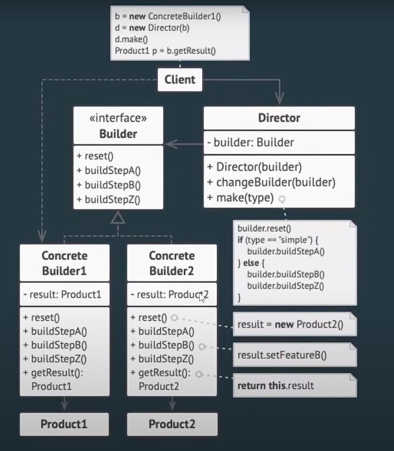
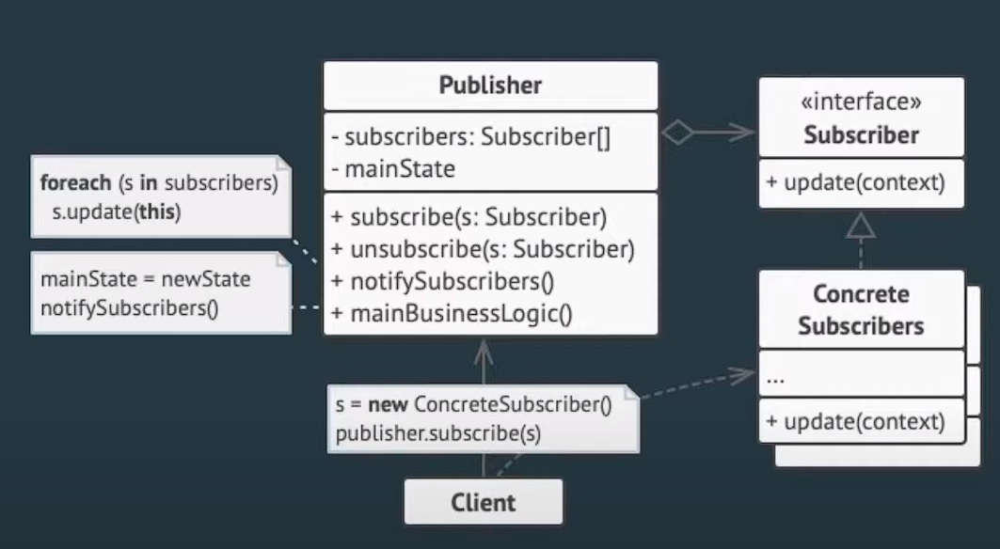

Desing Patterns ~ 🚀

-🤔 O que são:
<ul>
<li>Modele de uma solução adaptável criada para resolver um problema específico;</li>
<li>Design patterns não são uma solução pronta, nem algo a ser usado sempre.</li>
</ul>
-😎 Vantagens:
<ul>
<li>Flexibilidade;</li>
<li>Manutenibilidade;</li>
<li>Reusabilidade.</li>
</ul>
-😉 Tipos de padrôes:
<ul>
<li>Criacionais: Focados nos mecanismos de criação de objetos;</li>
<li>Estruturais: Focados na combinação de objetos e classe para criar estruturas mais elaboradas;</li>
<li>Comportamentais: Focados nas responsabilidades e interações dos objetos. </li>
</ul>

-🤗 Tipos de Disign Patterns:
<ol>
<li>
Builder:

Permite construir objetos complexos passo a passo.

</li>
<li>
Facade:

Fornece uma interface simplificada para um conjunto de classes e métodos complexos como uma biblioteca ou framework.

</li>
<li>
Observer:

Cria um mecanismo de inscrição que permite notificar vários objetos dos eventos que acontecem no objeto observado.

</li>
</ol>

Fontes: <a src='https://www.youtube.com/watch?v=A3zr57hZjMo&t=392s&ab_channel=OneBitCode' target="_blank">OneBitCode Youtube</a>
